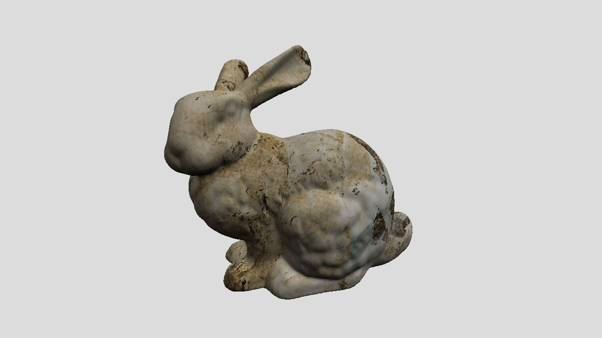

# CudaBasedSoftRenderer
A simple rasterizer implemented by cuda.

## Build
Use the following instructions to build the project.
``` shell
mkdir build
cd build
cmake ..
make
```
This should produce the cudaRenderer or cudaRenderer.exe in ```build``` dir.

## Command Line Option
Simple command line option are provided to the program.
```
--scene_file        Path to the scene file for the input of the program, which contains the location of camera and mesh obj as well as some other infomation.
--render_mode       Should be either 'transparent' or 'opaque'.
```

## Output
The output of the program will be stored under ```output``` directory.

